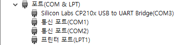
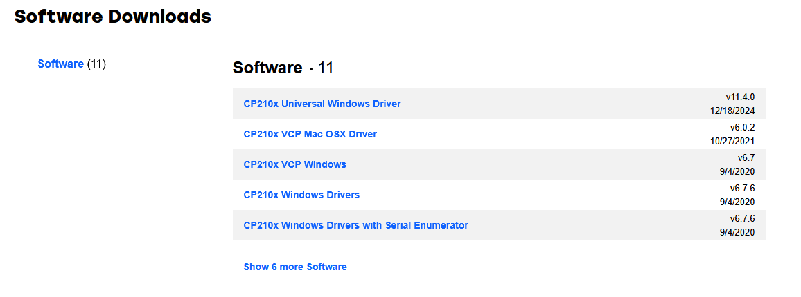
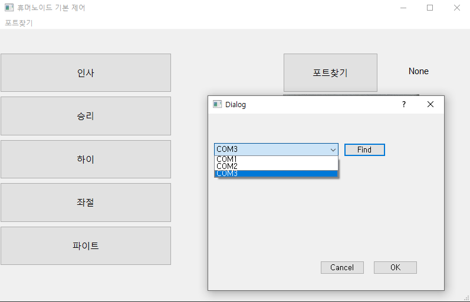

# humanoidMotionControl(w.python)
## 1. UART(Universal Asynchronous Receiver/Transmitter) 통신
### 로봇을 움직이기 위한 유선 통신
#### 로봇을 움직이기 위한 유/무선 통제 방법 중 유선 방법(UART)에 대해 알아보았습니다.
#### UART는 비동기 직렬 통신 프로토콜 중 하나로 두 장치간 데이터를 한비트씩 순차적으로 주고받는 방식입니다.
## 2. Protocol
### 모든 기기간에는 Protocol(통신규약)이 있다.
#### 휴머노이드의 모션을 제어하기 위한 프로토콜은 15byte로 되어있다.
## 3. pySerial
### 파이썬에서 외부기기(humanoid)를 제어하기 위한 방법 
#### humanoid 기기 usb 동글을 연결하고 com3로 잡히는지 확인

#### 만약에 잡히지 않을 경우 드라이버를 따로 설치해줘야 합니다.
https://www.silabs.com/developer-tools/usb-to-uart-bridge-vcp-drivers?tab=downloads

## 4. 결과물
### 프로그램 실행시 com3가 정상적으로 잡히고 동작버튼을 누르면 해당 동작을 잘 수행하는 것을 볼 수 있습니다.

